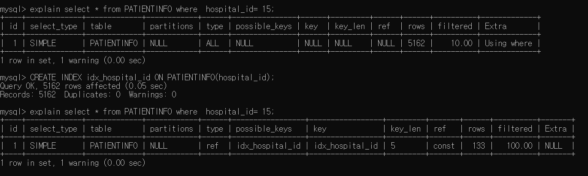

# 한국 코로나 데이터 DATABASE 설계 
by 양다영, 최예린

<br>
<br>

## 과제 4
>Patient 를 Hospital 의 수용 인원에 맞게 배정합니다
1. Hosiptial.csv 에 대한 table 을 만듬
2. Patientinfo 와 Region 테이블의 데이터 활용하여 hospital 의 수용 인원에 맞게 patient 를 hospital 에 배정
(Patientinfo table 에 hospital_id attribute 를 추가하여서 해당 환자가 어디 병언에 입원 중인지 나타냄)

## [배정조건]
1. 환자의 province 와 city 에 해당하는 위도 경도를 region 에서 찾아서 위치를 구한 뒤 가장 가까운 병원 배정
2. 만약 그 병원의 수용인원이 모두 찼다면 그 다음 가까운 병원에 넣음
3. 환자의 city 가 etc 인 경우에는 province 의 대표 위도 경도 (Seoul, region_id : 10000)를 사용
4. Php 를 통해 patient_id 를 입력하여 해당 patient 를 검색하거나 또는 hospital id 를 통해 해당 병원에 입원중인 patient 를 데이터베이스에 읽어오는 web 을 구현

<br>
<br>

## [CREATE HOSPITAL TABLE SQL문]
```SQL
drop TABLE HOSPITAL;
CREATE table HOSPITAL(
    hospital_id INT NOT NULL,
    hospital_name VARCHAR(100),
    hospital_province VARCHAR(50),
    hospital_city VARCHAR(50),
    hospital_latitude FLOAT DEFAULT NULL,
    hospital_longitude FLOAT DEFAULT NULL,
    capacity INT,
    current INT,

    PRIMARY KEY (hospital_id)
);

ALTER TABLE PATIENTINFO add column hospital_id INT DEFAULT NULL;
```
* 새로 HOSPITAL 테이블을 생성하고 Hospital.csv 파일의 데이터를 p4_hospital_insert.py 코드를 이용해 INSERT 해줌.
* PATIENTINFO 테이블에도 hospital_id라는 새로운 attribute 칼럼을 추가해준다.


```SQL
-- PATIENTINFO UPDATE
UPDATE PATIENTINFO SET city=province WHERE city IS NULL OR city="etc"
```
 기존의 데이터에는 city가 null이거나 etc(기타)인 경우가 있어 병원과의 거리를 비교하는데에 문제가 발생했다.
 
 그래서 미리 PATIENTINFO city가 null이거나 etc인 경우 province값을 city에 그대로 반복해 넣어 위의 문제를 해결했다.


<br>
<br>

## [환자를 병원에 배정하기]
> 환자와 병원의 위치정보로 유클리디안 거리를 구한 뒤 가장 가까운 순서대로 병원을 배정하여 PATIENTINFO에 hospital_id 값을 입력함.
### p4_patient_assignment.py

```python
for patient_data in patient_location: 
    min_dis = 99999999
    min_hospital_id = 1
    patient_lat_long = []
    
    patient_lat_long.append(patient_data[1])
    patient_lat_long.append(patient_data[2])
    #print(hospital_lat_long)
    #print()
    
    #환자 한명이랑 병원 한개씩 거리 계산하기
    for hospital_data in hospital_location:
        
        #만약 수용인원을 넘겼다면 그 병원은 제외하기.
        if hospital_data[3] <= hospital_current[hospital_data[0]]:
             # 처리처리 
            continue
        
        hospital_lat_long = []
        hospital_lat_long.append(hospital_data[1])
        hospital_lat_long.append(hospital_data[2])
        
        # 병원과 환자간의 유클리디안 거리 구하기 
        euc_result = math.floor(euclidean_distance(np.array(patient_lat_long*10000), np.array(hospital_lat_long*10000)))
        #print(euc_result)
        #최단거리 구하기업뎃해주기 
        if euc_result <=  min_dis:
            min_dis = euc_result
            min_hospital_id = hospital_data[0]
```

환자 데이터를 모두 받아온 후 반복문을 돌면서 유클리디안 거리가 가장 짧은 병원을 찾은 뒤 그 병원의 id를 min_hospital_id 변수에 저장해 놓고 SQL문으로 patientinfo 테이블의 hospital_id의 값으로 min_hospital_id를 넣는다.

<br>
<br>

## [지도 하이퍼링크 추가하기 ]
### p4_where_are_you_.php
```PHP
    <?php
        if(isset($_POST['s'])){
            
            $post_province= $_POST['id'];
            $sql = "select * from PATIENTINFO where  hospital_id= '$post_province';";
            $result = mysqli_query($link, $sql);
            while($row = mysqli_fetch_assoc($result)) {
                print "<tr>";
                foreach($row as $key => $val){
                    
                    
                    if($key=='hospital_id'){
                        print "<td> <a href='p4_map?hospital_id={$val}' target='_blank'>". $val . "</a></td>";
                        
                    }
                    else{
                    print "<td>" . $val . "</td>";}
                }
                print "</tr>";
            }
        }
        

      ?>
```

* foreach 구문에서 $key를 이용해 attribute가 hospital_id이면 하이퍼텍스트(<a href=\''><\/a>)를 출력하고 그 외에는 일반 text로 $val 값이 출력되도록 구현함.
* target='_blank' 속성을 사용해 새탭에서 창이 열리도록 구현함.

<br>
<br>

## [지도 띄우기]
### p4_map.php
```php
<?php
    echo $_GET['hospital_id'];
    $get_hospital_id=$_GET['hospital_id'];
    $sql = "select hospital_name as name, hospital_latitude as lat, hospital_longitude as lon from HOSPITAL where  hospital_id= $get_hospital_id;";
    #echo $sql;
    $result = mysqli_query($link, $sql);
    $data = mysqli_fetch_assoc($result);
?>
```
URL을 통해 hospital_id를 받아온 뒤 sql문을 실행시켜 해당 병원에 대한 정보를 가져옴.

```javaScript
<script type="text/javascript">
      $(document).ready(function() {
         var myLatlng = new google.maps.LatLng( "<?=  $data['lat'] ?>", "<?=  $data['lon'] ?>"); // 위치값 위도 경도
   var Y_point         = <?=  $data['lat'] ?>;  // Y 좌표
   var X_point         = <?=  $data['lon'] ?>;  // X 좌표

   </script>
```
php에서 javaScript로 변수값을 받아오기위해서 <?= $data['']?> 형식을 사용함.
병원의 위도, 경도에 해당하는 곳에 마크를 생성하고 구글맵에 띄움.

<br>
<br>

## [인덱싱]

### indexing_hospital_id

>병원 번호로 환자 찾기 

    select * from PATIENTINFO where  hospital_id= 15;

>hospital_id를 인덱스로 만들기 

    CREATE INDEX idx_hospital_id ON PATIENTINFO(hospital_id);

>idx_hospital_id를 인덱스로 병원 번호에 해당하는 환자 찾기   
    
    explain select * from PATIENTINFO where  hospital_id= 15;

>5162개 검색에서 133개 검색으로 성능 향상됨. 

<br>
<br>


### indexing_hospital_id_r2


>idx_hospital_id를 인덱스로 병원 번호에 해당하는 환자 찾기2  

    select patient_id, hospital_id from PATIENTINFO where hospital_id = 35;

    explain select patient_id, hospital_id from PATIENTINFO where hospital_id = 35;


>idx_patient_id 성능향상 없음
    
    CREATE INDEX idx_patient_id ON PATIENTINFO(patient_id);

    explain select * from PATIENTINFO  use index (idx_patient_id)where  hospital_id= 15;
    explain select patient_id, hospital_id  from PATIENTINFO use index (idx_patient_id) where hospital_id = 35;

## 결론
>위의 결과를 통해 hospital_id의 성능이 가장 좋다는 것을 알 수 있음.